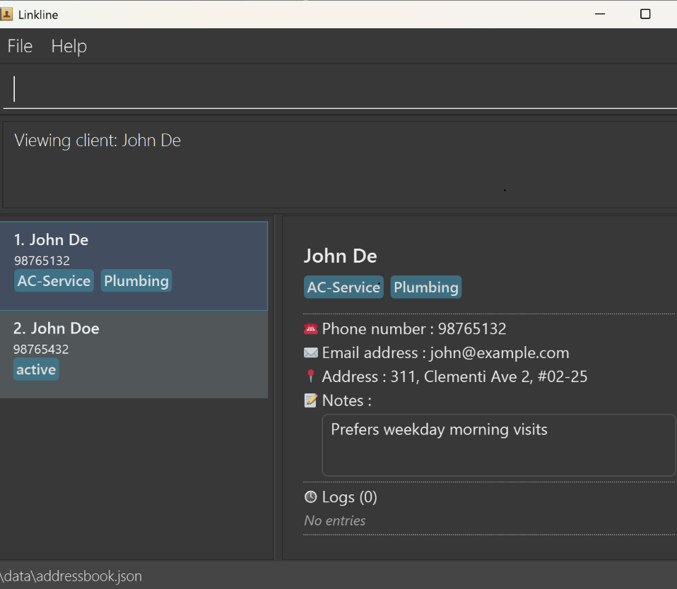
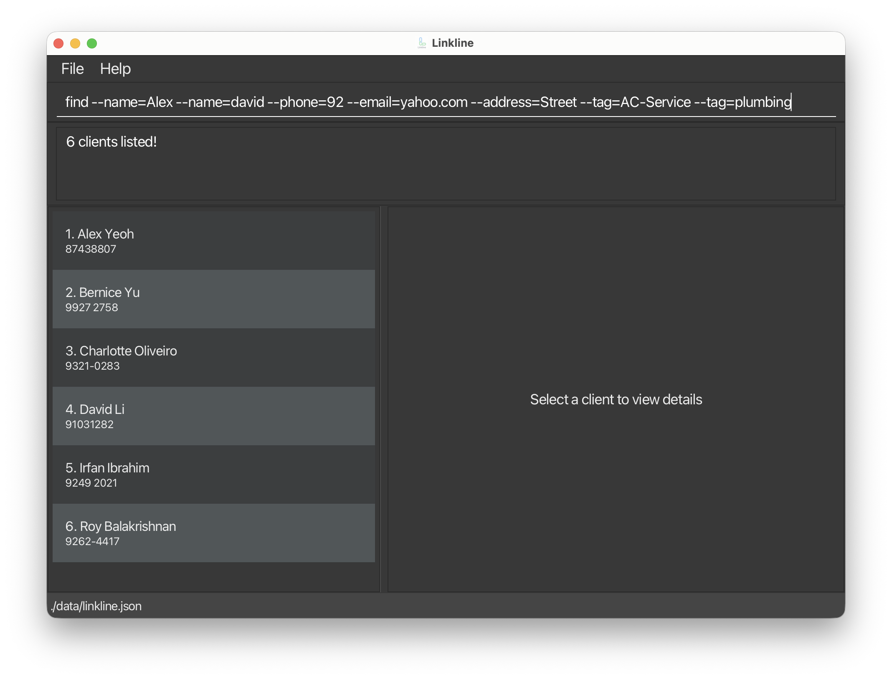

# Linkline User Guide

Linkline is a **desktop app for solo technicians to manage client details, optimized for use via a Command Line
Interface** (CLI) while still having the benefits of a Graphical User Interface (GUI). If you can type fast, Linkline
can get your contact management tasks done faster than traditional GUI apps.

<!-- * Table of Contents -->
<page-nav-print />

--------------------------------------------------------------------------------------------------------------------

## Quick start

1. Ensure you have Java `17` or above installed in your Computer. 
   **Mac users:** Ensure you have the precise JDK version
   prescribed [here](https://se-education.org/guides/tutorials/javaInstallationMac.html).

1. Download the latest `.jar` file from [here](https://github.com/AY2526S2-CS2103-F09-4/tp/releases).

1. Copy the file to the folder you want to use as the _home folder_ for Linkline.

1. Open a command terminal, `cd` into the folder you put the jar file in, and use the `java -jar linkline.jar` command
   to run the application. 
   A GUI similar to the below should appear in a few seconds. Note how the app contains some sample data. 
   

1. Type the command in the command box and press Enter to execute it. e.g. typing **`help`** and pressing Enter will
   open the help window. 
   Some example commands you can try:

    * `list` : Lists all contacts.

    * `add --name=John Doe --phone=98765432 --email=johnd@example.com --address=John street, block 123, #01-01` : Adds a
      contact named `John Doe` to the Address Book.

    * `copyaddr 3` : Copies the address of the 3rd contact shown in the current list to user's clipboard.

    * `clear` : Deletes all contacts.

    * `exit` : Exits the app.

1. Refer to the [Features](#features) below for details of each command.

--------------------------------------------------------------------------------------------------------------------

## Features

<box type="info" seamless>

**Notes about the command format:** 

* Words in `UPPER_CASE` are the parameters to be supplied by the user. 
  e.g. in `add --name=NAME`, `NAME` is a parameter which can be used as `add --name=John Doe`.

* Items in square brackets are optional. 
  e.g `--name=NAME [--tag=TAG]` can be used as `--name=John Doe --tag=AC-Service` or as `--name=John Doe`.

* Items with `…`​ after them can be used multiple times including zero times. 
  e.g. `[--tag=TAG]…​` can be used as ` ` (i.e. 0 times), `--tag=AC-Service`, `--tag=AC-Service --tag=Plumbing` etc.

* Parameters can be in any order except for `renametag`. 
  e.g. if the command specifies `--name=NAME --phone=PHONE_NUMBER`, `--phone=PHONE_NUMBER --name=NAME` is also
  acceptable.

* If you are using a PDF version of this document, be careful when copying and pasting commands that span multiple lines
  as space characters surrounding line-breaks may be omitted when copied over to the application.
  </box>

### Field constraints

The following constraints apply to command fields:

* `NAME`: must not be blank, up to 100 characters.
* `PHONE_NUMBER`: must contain 3 to 15 digits in total. Spaces and hyphens are allowed only between digits.
* `EMAIL`: must be in valid `local-part@domain` format and satisfy email length/rule checks.
* `ADDRESS`: must not be blank.
* `TAG`: must not be blank, 1 to 50 characters.
* `NOTES`: 0 to 200 characters.
* `LOG_MESSAGE`: must not be blank, 1 to 1000 characters.

### Viewing help : `help`

Shows a message explaining how to access the help page.

Format: `help`

* This command does not accept any arguments.
* Entering `help` with additional parameters (e.g., `help 123`) will return an error message.

### Adding a client: `add`

Adds a client to the address book. List is automatically sorted lexicographically by `NAME`, followed by `PHONE_NUMBER`

* Client with the same email or phone number as an existing client in the address book cannot be added as they are
  considered duplicated clients.

Format: `add --name=NAME --phone=PHONE_NUMBER --email=EMAIL --address=ADDRESS [--tag=TAG]…​ [--notes=NOTES]`

<box type="tip" seamless>

**Tip:** A client can have any number of tags (including 0) and 1 or 0 notes.
</box>

Examples:

* `add --name=John Doe --phone=9876-5432 --email=johnd@example.com --address=John street, block 123, #01-01`
* `add --name=Betsy Crowe --tag=AC service --email=betsycrowe@example.com --address=123 Clementi Rd #04-05 --phone=9123 4567 --notes=Gate code 1234, beware of large dog`

### Listing all clients : `list`

Shows a sorted list of all clients in the address book.

Format: `list`

* This command does not accept any arguments.
* Entering `list` with additional parameters (e.g., `list 123`) will return an error message.

### Editing a client : `edit`

Edits an existing client in the address book.

Format:
`edit INDEX [--name=NAME] [--phone=PHONE_NUMBER] [--email=EMAIL] [--address=ADDRESS] [--tag=TAG]…​ [--notes=NOTES]`

* Edits the client at the specified `INDEX`.
* The index refers to the index number shown in the displayed client list.
* The index **must be a positive integer** 1, 2, 3, …​
* At least one of the optional fields must be provided.
* Existing values will be updated to the input values.
* When editing tags, the existing tags of the client will be removed i.e adding of tags is not cumulative.
* You can remove all the client’s tags or notes by typing `--tag=` or `--notes=` respectively without specifying any
  tags after it.
* If the edited client duplicates another existing client in the address book, the edit will fail.

Examples:

* `edit 1 --phone=91234567 --email=johndoe@example.com` Edits the phone number and email address of the 1st client to be
  `91234567` and `johndoe@example.com` respectively.
* `edit 2 --name=Betsy Crower --tag=` Edits the name of the 2nd client to be `Betsy Crower` and clears all existing
  tags.

### Locating clients by personal details: `find`

Finds clients whose names / phone numbers / email address / physical address / tags are matched by the queried keywords
specified per field. A sorted list of such clients is returned.

Any `find` operation is applied only to the currently displayed list, and multiple `find` / `filter` operations can be
chained together to shorten the list.

For example, if there are 10 clients initially on the list, and a `find` / `filter` operations shortens it to 5 clients,
any subsequent `find` / `filter` operations would only search within those 5 clients.

Format:
`find [--name=SUBNAME [--name=MORE_SUBNAMES] ...] [--phone=SUBNUMBER [--phone=MORE_SUBNUMBERS] ...] [--email=SUBEMAIL [--email=MORE_SUBEMAILS] ...] [--address=SUBADDRESS [--address=MORE_SUBADDRESS] ...] [--tag=TAG [--tag=MORE_TAGS] ...]`

* Any preamble given will result in an error.
* At least one of the optional fields must be provided.
* If a field is specified, it must not be empty.
* A field can be specified as many times as keywords are required.
* The order in which the fields are specified does not matter.
* Only the fields specified are searched against.
* In all fields, the search is case-insensitive. e.g. In name field, `hans` will match `Hans`.
* In all fields, the order of the keywords does not matter. e.g. In name field, `Hans Bo` will match `Bo Hans`.
* In name, phone number, email address, physical address fields, clients whose field matches at least one keyword in
  that specified field as a substring will be returned (i.e. `OR` search). e.g. In name field, `Gru Ya` will match
  `Hans Gruber`, `Bo Yang`.
* In tag field, clients whose field match at least one keyword in that specified field exactly will be returned (i.e.
  `OR` search) as a union with the other fields mentioned. e.g. In
  tag field `AC-Service` will match only `AC-Service`.

Examples:

* `find` is not a valid command as no fields are provided.
* `find --name=Alice --phone= --email=gmail.com` is not a valid command as phone field is specified but empty.
* `find --name=Alice Bob` will have 1 keyword `Alice Bob`.
* `find --name=Alice --name=Bob` will have 2 name keywords `Alice` and `Bob`.
* `find --name=jon --name=Jack` can return clients with names `Jonathon Lee`, `Jon Doe`, and `Jack Black`.
* `find --phone=1234` can return clients with numbers `91234567` and `94561234`.
* `find --email=.edu` can return clients with email addresses `e123456678@u.nus.edu` and `f123456678@u.ntu.edu`.
* `find --address=Street` can return clients with physical addresses `Woodlands Street`, `Admiralty Street`
* `find --tag=wiring` can return clients with tag `Wiring`, but not `ElectricalWiring`,
* `find --name=James --name=Jake --phone=123 --phone=4567 --email=@yahoo.com --address=Street --address=Avenue --address=Boulevard --tag=Aircon-Repair`
is a valid combination of all fields.
* `find --phone=123 --phone=4567 --name=James --name=Jake --tag=Aircon-Repair --email=@yahoo.com --address=Street --address=Avenue --address=Boulevard`
will return the same results as the previous command. 

### Deleting a client : `delete`

Deletes the specified client from the address book with confirmation.

Format: `delete INDEX`

* Deletes the client at the specified `INDEX`.
* The index refers to the index number shown in the displayed client list.
* The index **must be a positive integer** 1, 2, 3, …​
* **Two-step confirmation**:
    * First run of `delete INDEX`: shows a confirmation message only (no deletion yet).
    * Second matching `delete INDEX`: completes the deletion.
* Any other command (including invalid command input) after the first `delete` will cancel the pending deletion.

Examples:

* `list` followed by `delete 2`
    * Shows confirmation message with the client's details (no deletion yet).
    * Typing `delete 2` again confirms and deletes the 2nd client.
* `find --name=Betsy` followed by `delete 1`
    * Shows confirmation message for the 1st client in the search results, if exists (no deletion yet).
    * Typing `delete 1` again deletes that client.
* `delete 1` followed by `list`
    * The pending deletion is cancelled. The list command executes normally.

<box type="tip" seamless>

**Tip:** After the first `delete 1` command, any of the following will confirm the deletion: `delete 1` or `delete 01`.
Leading/trailing spaces and spaces between the command word and index are ignored, numbers with leading zeros (e.g., '01', '001') also confirm the deletion.
</box>

### Copying a client's address: `copyaddr`

Copies the specified client's address from the address book.

Format: `copyaddr INDEX`

* Copies the client's address at the specified `INDEX`.
* The index refers to the index number shown in the displayed client list.
* The index **must be a positive integer** 1, 2, 3, …​

### Copying a client's edit command format: `copyedit`

Copies the edit command format for the specified client, allowing you to easily modify their details.

Format: `copyedit INDEX`

* Copies the edit command with all current details of the client at the specified `INDEX`.
* The index refers to the index number shown in the displayed client list.
* The index must be a positive integer 1, 2, 3, …​
* The copied format includes the client's name, phone, email, address, notes, and all tags.

### Viewing client details: `view`

Shows the specified client's full details.

Format: `view INDEX`

* Shows the client's full details at the specified `INDEX` in the right-hand panel.
* The index refers to the index number shown in the current displayed client list.
* The index **must be a positive integer** 1, 2, 3, …​

Examples:

* `find --name=John Don` followed by `view 1`
* `add --name=John Doe --phone=9876-5432 --email=johnd@example.com --address=John street, block 123, #01-01` followed by `view 1`

### Adding a client log: `logadd`

Adds a timestamped log entry to the specified client.

Format: `logadd INDEX LOG_MESSAGE`

* Adds a new log entry to the client at the specified `INDEX`.
* The index refers to the index number shown in the displayed client list.
* The index **must be a positive integer** 1, 2, 3, ...
* `LOG_MESSAGE` must be between 1 and 1000 characters.

Examples:

* `logadd 1 Observed leakage beneath sink during site visit.`
* `logadd 2 Client requested follow-up call next Wednesday at 2pm.`

### Deleting a client log: `logdelete`

Deletes a specific log entry from the specified client with confirmation.

Format: `logdelete CLIENT_INDEX LOG_INDEX`

* Deletes the log at `LOG_INDEX` for the client at `CLIENT_INDEX`.
* `CLIENT_INDEX` refers to the index number shown in the displayed client list.
* `LOG_INDEX` refers to the log number shown in the UI for that client.
* **Log numbering note**: Logs are displayed newest-first, but numbered oldest-to-newest.
  For example, if a client has 5 logs, the topmost (and the latest) log is `Log 5`.
* Both indices **must be positive integers** 1, 2, 3, ...
* **Two-step confirmation**:
    * First run of `logdelete CLIENT_INDEX LOG_INDEX`: shows a confirmation message only (no deletion yet).
    * Second matching `logdelete CLIENT_INDEX LOG_INDEX`: deletes the selected log.
* Any other command (including invalid command input) after the first `logdelete` will cancel the pending log deletion.

Examples:

* `view 2` followed by `logdelete 2 1`
    * Shows confirmation message for log `1` of client `2` (no deletion yet).
    * Typing `logdelete 2 1` again confirms and deletes that log.
* `logdelete 2 1` followed by `list`
    * The pending log deletion is cancelled. The list command executes normally.

### Filtering clients by tags: `filter`

Filters clients whose tags contain all the given keywords. If there is more than one client, the list returned is
sorted.

Format: `filter --tag=TAG_KEYWORD [--tag=MORE_KEYWORDS]…​`

* Multiple keywords can be provided, separated by spaces
* The filter is case-insensitive. e.g `Plumbing` will match `plumbing`
* Only filters by tags.
* Only clients matching all one keyword will be returned (i.e. `AND` search).

### Renaming a tag: `renametag`

Renames an existing tag to a new name across the entire address book. All clients with the old tag will be updated with
the new tag name.

Format: `renametag --tag=OLD_TAG --tag=NEW_TAG`

* Tags have to be in this specific order and only 2 parameters are accepted.
* The `OLD_TAG` must exist in the address book.
* The `NEW_TAG` must be a valid tag name and should not already exist in the address book.
* Tag names are case-insensitive. e.g., `PLUMBING` and `plumbing` are considered the same tag.

Examples:

* `renametag --tag=AC-Service --tag=Aircon-Repair` renames all instances of `AC-Service` to `Aircon-Repair`.
* `renametag --tag=plumbing --tag=General-Maintenance` renames the `plumbing` tag to `General-Maintenance`.

### Deleting a tag: `deletetag`

Deletes a specific tag and removes it from all clients currently having it.

Format: `deletetag TAG_NAME`

* The `TAG_NAME` must exist in the address book.
* **Two-step confirmation**:
    * First run of `deletetag TAG_NAME`: shows a confirmation message only (no deletion yet).
    * Second matching `deletetag TAG_NAME`: removes that tag globally from all clients.
* Any other command (including invalid command input) after the first `deletetag` will cancel the pending tag deletion.
* This operation cannot be undone.

Examples:

* `deletetag plumbing`
    * Shows confirmation message for deleting tag `plumbing` (no deletion yet).
    * Typing `deletetag plumbing` again confirms and removes it from all clients.
* `deletetag plumbing` followed by `list`
    * The pending tag deletion is cancelled. The list command executes normally.

### Clearing all entries : `clear`

Clears all entries from the address book.

Format: `clear`

* This command does not accept any arguments.
* Entering `clear` with additional parameters (e.g., `clear 123`) will return an error message.
* **Two-step confirmation**:
    * First run of `clear`: shows a confirmation message only (no clearing yet).
    * Second `clear`: clears all entries from the address book.
* Any other command (including invalid command input) after the first `clear` will cancel the pending action.

### Exiting the program : `exit`

Exits the program.

Format: `exit`

* This command does not accept any arguments.
* Entering `exit` with additional parameters (e.g., `exit 123`) will return an error message.

### Saving the data

LinkLine data are saved in the hard disk automatically after any command that changes the data. There is no need to save
manually.

### Editing the data file

LinkLine data are saved automatically as a JSON file `[JAR file location]/data/addressbook.json`. Advanced users are
welcome to update data directly by editing that data file.

<box type="warning" seamless>

**Caution:**
If your changes to the data file makes its format invalid, LinkLine will discard all data and start with an empty data
file at the next run. Hence, it is recommended to take a backup of the file before editing it. 
Furthermore, certain edits can cause the LinkLine to behave in unexpected ways (e.g., if a value entered is outside the
acceptable range). Therefore, edit the data file only if you are confident that you can update it correctly.
</box>

--------------------------------------------------------------------------------------------------------------------

## FAQ

**Q**: How do I transfer my data to another Computer? 
**A**: Install the app in the other computer and overwrite the empty data file it creates with the file that contains
the data of your previous LinkLine home folder.

--------------------------------------------------------------------------------------------------------------------

## Known issues

1. **When using multiple screens**, if you move the application to a secondary screen, and later switch to using only
   the primary screen, the GUI will open off-screen. The remedy is to delete the `preferences.json` file created by the
   application before running the application again.
2. **If you minimize the Help Window** and then run the `help` command (or use the `Help` menu, or the keyboard shortcut
   `F1`) again, the original Help Window will remain minimized, and no new Help Window will appear. The remedy is to
   manually restore the minimized Help Window.

--------------------------------------------------------------------------------------------------------------------

## Command summary

 Action                       | Format, Examples                                                                                                                                                                                                                                                                                                                                                                                       
------------------------------|--------------------------------------------------------------------------------------------------------------------------------------------------------------------------------------------------------------------------------------------------------------------------------------------------------------------------------------------------------------------------------------------------------
 **Add**                      | `add --name=NAME --phone=PHONE_NUMBER --email=EMAIL --address=ADDRESS [--tag=TAG]…​ [--notes=NOTES]`   e.g., `add --name=James Ho --phone=22224444 --email=jamesho@example.com --address=123, Clementi Rd, 1234665 --tag=AC-Service --tag=Plumbing --notes=Prefers morning visits`                                                                                                                  
 **Clear**                    | `clear`                                                                                                                                                                                                                                                                                                                                                                                                
 **Copy Address**             | `copyaddr INDEX`  e.g., `copyaddr 1`                                                                                                                                                                                                                                                                                                                                                                
 **Copy Edit Command Format** | `copyedit INDEX`  e.g., `copyedit 2`                                                                                                                                                                                                                                                                                                                                                               
 **Delete**                   | `delete INDEX`  e.g., `delete 3`                                                                                                                                                                                                                                                                                                                                                                    
 **Delete Tag**               | `deletetag TAG_NAME`  e.g., `deletetag plumbing`                                                                                                                                                                                                                                                                                                                                                    
 **Edit**                     | `edit INDEX [--name=NAME] [--phone=PHONE_NUMBER] [--email=EMAIL] [--address=ADDRESS] [--tag=TAG]…​ [--notes=NOTES]`  e.g.,`edit 2 --name=James Lee --email=jameslee@example.com`                                                                                                                                                                                                                    
 **Filter**                   | `filter --tag=TAG_KEYWORD [--tag=MORE_KEYWORDS]…​`  e.g., `filter --tag=Plumbing`                                                                                                                                                                                                                                                                                                                   
 **Find**                     | `find [--name=SUBNAME [--name=MORE_SUBNAMES] ...] [--phone=SUBNUMBER [--phone=MORE_SUBNUMBERS] ...] [--email=SUBEMAIL [--email=MORE_SUBEMAILS] ...] [--address=SUBADDRESS [--address=MORE_SUBADDRESS] ...] [--tag=TAG [--tag=MORE_TAGS] ...]`  e.g., `find --name=James --name=Jake --phone=123 --phone=4567 --email=@yahoo.com --address=Street --address=Avenue --address=Boulevard --tag=Aircon-Repair` 
 **Help**                     | `help`                                                                                                                                                                                                                                                                                                                                                                                                 
 **List**                     | `list`                                                                                                                                                                                                                                                                                                                                                                                                 
 **Log Add**                  | `logadd INDEX LOG_MESSAGE`  e.g., `logadd 1 Observed leakage beneath sink during site visit.`                                                                                                                                                                                                                                                                                                     
 **Log Delete**               | `logdelete CLIENT_INDEX LOG_INDEX`  e.g., `logdelete 2 1`                                                                                                                                                                                                                                                                                                                                         
 **Rename Tag**               | `renametag --tag=OLD_TAG --tag=NEW_TAG`  e.g., `renametag --tag=AC-Service --tag=Aircon-Repair`                                                                                                                                                                                                                                                                                                     
 **View**                     | `view INDEX`  e.g., `view 1`                                                                                                                                                                                                                                                                                                                                                                        

